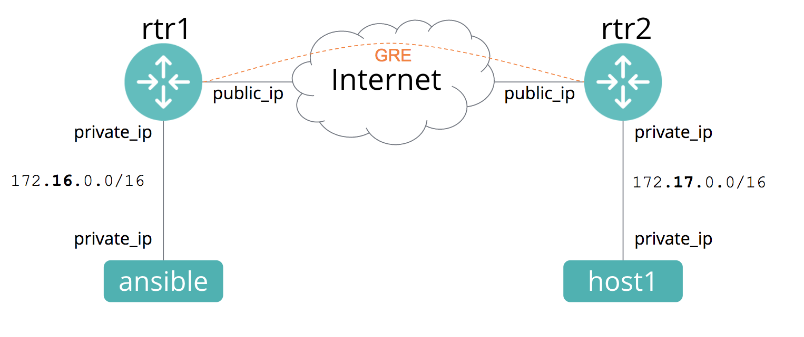

# Exercise 1.3 - Creating a GRE Tunnel

Let’s work on our next playbook.  This playbook will create a Generic Routing Encapsulation Tunnel, also called a [GRE tunnel](https://en.wikipedia.org/wiki/Generic_Routing_Encapsulation), between rtr1 and rtr2.

Before we go into creating the playbook, let’s look at what we’re trying to accomplish.
- We have two VPC’s, VPC-1 & VPC-2 with rtr1 and rtr2 residing in each VPC respectively
- We are going to bridge the two VPC’s via a GRE Tunnel between rtr1 and rtr2



## Table of Contents
- [Step 1: Navigate to the workshop directory](#step-1-navigate-to-the-networking_workshop-directory)
- [Step 2: Let’s create our playbook named gre.yml](#step-2-lets-create-our-playbook-named-greyml)
- [Step 3: Setting up your playbook](#step-3-setting-up-your-playbook)
- [Step 4: Adding the tasks for R1](#step-4-adding-the-tasks-for-r1)
- [Step 5: Setting up the play for R2](#step-5-setting-up-the-play-for-r2)
- [Step 6: Running the playbook](#step-6-running-the-playbook)

**What you will learn:**
 - ios_config module
 - parents keyword
 - conditionals

 ---

## Step 1: Navigate to the workshop directory

```bash
cd ~/networking_workshop
```

## Step 2: Let’s create our playbook named gre.yml

```bash
vim gre.yml
```

## Step 3: Setting up your playbook

In this playbook we need to configure both sides of the GRE tunnel.  The tunnel source can be configured to a physical interface.  The tunnel destination needs to be a reachable IP address.  In this case rtr1's tunnel destination needs to be rtr2's public IP address.

```bash
---
- name: Configure GRE Tunnel between rtr1 and rtr2
  hosts: routers
  gather_facts: no
  connection: local
```

We also need **two variables**.  We need the public IP address for rtr1 and rtr2.  These two IP addresses will be different for every student in the workshop.  The public IP address can be found in the `~/networking_workshop/lab_inventory/hosts` on the ansible node.  Just call these `rtr1_public_ip` and `rtr2_public_ip`.  The IP address 1.1.1.1 and 2.2.2.2 are placeholders!  Please replace them, or use the dynamic mode below:
```yml
vars:
   #Variables can be manually set like this:
   rtr1_public_ip: "1.1.1.1"
   rtr2_public_ip: "2.2.2.2"
```

or you can also dynamically reference another host's variable like this:


```yml
vars:
  rtr1_public_ip: "{{hostvars['rtr1']['ansible_host']}}"
  rtr2_public_ip: "{{hostvars['rtr2']['ansible_host']}}"
```


hostvars refers to a variables host specific variables, `rtr1` and `rtr2` refer to the specific host, and `ansible_host` refers to the public IP address (which happens to also be the IP address we use to connect with Ansible).  These host variables are gathered from the inventory file `~/networking_workshop/lab_inventory/hosts`

## Step 4: Adding the tasks for R1


```bash
tasks:
- name: create tunnel interface to R2
  ios_config:
    lines:
     - 'ip address 10.0.0.1 255.255.255.0'
     - 'tunnel source GigabitEthernet1'
     - 'tunnel destination {{rtr2_public_ip}}'
    parents: interface Tunnel 0
  when:
    - '"rtr1" in inventory_hostname'
```    


Notice the `when` statement shown above.  This is a conditional.  If the inventory_hostname matches the string `rtr1` we will run this task.  Otherwise we will **skip**.  The only time you will see a **skip** is when a when statement is being used.  For more [information on conditionals click here](http://docs.ansible.com/ansible/latest/playbooks_conditionals.html).

## Step 5: Setting up the play for R2


```bash
- name: create tunnel interface to R1
  ios_config:
    lines:
     - 'ip address 10.0.0.2 255.255.255.0'
     - 'tunnel source GigabitEthernet1'
     - 'tunnel destination {{rtr1_public_ip}}'
    parents: interface Tunnel 0
  when:
    - '"rtr2" in inventory_hostname'
```


Now that you’ve completed writing your playbook, let’s go ahead and save it.  Use the write/quit method in vim to save your playbook, i.e. hit Esc then `:wq!`  We now have our second playbook. Let’s go ahead and run that awesomeness!

## Step 6: Running the playbook
From your lightbulb directory, run the gre.yml playbook
```bash
ansible-playbook gre.yml
```

You’ve successfully created a playbook that uses conditionals! Check out the [ios_config module](http://docs.ansible.com/ansible/latest/ios_config_module.html) for more information on different available knobs and parameters for the module.

# Complete
You have completed lab exercise 1.3

# Answer Key
You can [click here](https://github.com/network-automation/lightbulb/blob/master/workshops/networking/1.3-gre/gre.yml).

 ---
[Click Here to return to the Ansible Lightbulb - Networking Workshop](../README.md)
