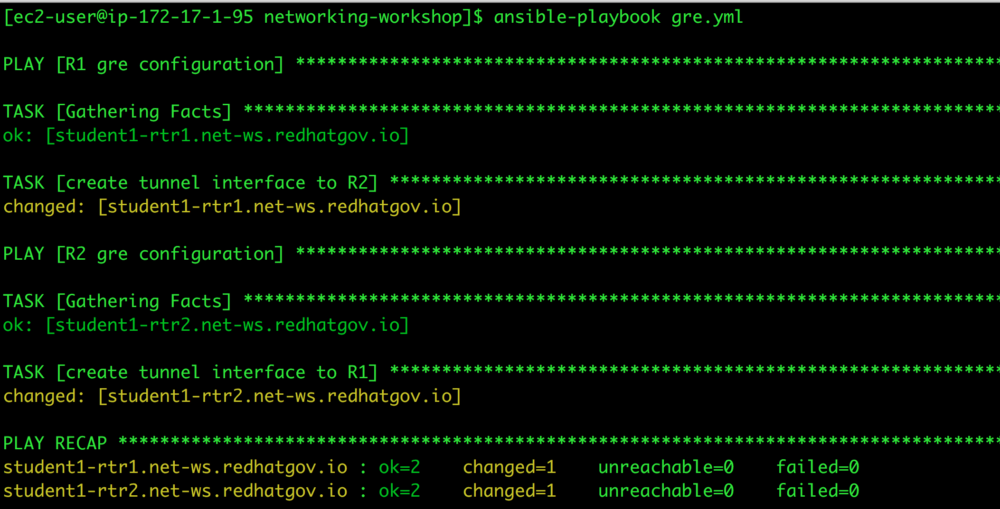

# Exercise 1.3 - Creating a GRE Tunnel

Let’s work on our next playbook, creating a GRE Tunnel between rtr1 & rtr2

Before we go into creating the playbook, let’s look at what we’re trying to accomplish.
- We have two VPC’s, VPC 1 & VPC 2 with rtr1 and rtr2 residing in each VPC respectively
- We are going to bridge the two VPC’s via a GRE Tunnel between rtr1 and rtr2
- We’ll use the GigabitEthernet1 interface on both routers to configure the tunnel

## Table of Contents
- [Step 1: Make sure you’re in the networking-workshop directory](#step-1-make-sure-youre-in-the-networking-workshop-directory)
- [Step 2: Let’s create our playbook named gre.yml](#step-2-lets-create-our-playbook-named-greyml)
- [Step 3: Setting up your playbook](#step-3-setting-up-your-playbook)
- [Step 4: Adding the tasks for R1](#step-4-adding-the-tasks-for-r1)
- [Step 5: Setting up the play for R2](#step-5-setting-up-the-play-for-r2)
- [Step 6: Adding the tasks for R2](#step-6-adding-the-tasks-for-r2)
- [Step 7: Running the playbook](#step-7-running-the-playbook)

## Step 1: Make sure you’re in the networking-workshop directory

```bash
cd ~/networking-workshop
```

Before we go into creating the playbook, let’s look at what we’re trying to accomplish.
- We have two VPC’s, VPC 1 & VPC 2 with rtr1 and rtr2 residing in each VPC respectively
- We are going to bridge the two VPC’s via a GRE Tunnel between rtr1 and rtr2
- We’ll use the GigabitEthernet1 interface on both routers to configure the tunnel

## Step 2: Let’s create our playbook named gre.yml

```bash
vim gre.yml
```

## Step 3: Setting up your playbook

In this playbook, we’ll be running two plays, one for each router.
Let’s start with router 1.
Note that the "hosts:" is targeting **rtr1**

```bash
---
- hosts: student(X)-rtr1.net-ws.redhatgov.io
  name: create GRE Tunnel on R1
  gather_facts: no
```

## Step 4: Adding the tasks for R1

```bash
tasks:
  - name: create tunnel interface to R2
    ios_config:
      lines:
       - ip address 10.0.0.1 255.255.255.0
       - tunnel source GigabitEthernet1
       - tunnel destination <IP of Router 2>
    parents: interface Tunnel 0
```    

## Step 5: Setting up the play for R2

Note that the "hosts:" is targeting rtr2

```bash
- hosts: student(X)-rtr2.net-ws.redhatgov.io
  name: create GRE Tunnel on R2
  gather_facts: no
```

## Step 6: Adding the tasks for R2

```bash
tasks:
  - name: create tunnel interface to R2
    ios_config:
      lines:
       - ip address 10.0.0.2 255.255.255.0
       - tunnel source GigabitEthernet1
       - tunnel destination <IP of Router 1>
    parents: interface Tunnel 0
```   

Now that you’ve completed writing your playbook, let’s go ahead and save it.  Use the write/quit method in vim to save your playbook, i.e. hit Esc then `:wq!`  We now have our second playbook. Let’s go ahead and run that awesomeness!

## Step 7: Running the playbook
From your networking-workshop directory, run the gre.yml playbook
```bash
ansible-playbook gre.yml
```



You’ve successfully created a playbook that targets both routers in sequential order. Woohoo!  The GRE Tunnel should be configured. Feel free to log into any of the routers and ping the other endpoint of the tunnel.  Check out the [ios_config module](http://docs.ansible.com/ansible/latest/ios_config_module.html) for more information on different available knobs and parameters for the module.
