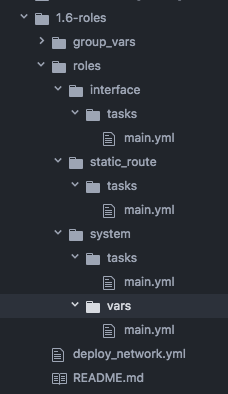

# Exercise 1.6 - Roles: Making your playbooks reusable

While it is possible to write a playbook in one file as we’ve done throughout this workshop, eventually you’ll want to reuse files and start to organize things.

Ansible Roles is the way we do this. When you create a role, you deconstruct your playbook into parts and those parts sit in a directory structure. This is thoroughly elaborated on in the [best practice guide](http://docs.ansible.com/ansible/playbooks_best_practices.html) mentioned in exercise 1.2. Yep, that one.

For this exercise, you are going to take the playbook you just wrote and refactor it into a role. In addition, you’ll learn to use Ansible Galaxy.

Let’s begin with seeing how your apache-basic-playbook will break down into a role.



Fortunately, you don’t have to create all of these directories and files by hand. That’s where Ansible Galaxy comes in.

## Section 1 - Using Ansible Galaxy to initialize a new role

Ansible Galaxy is a free site for finding, downloading, and sharing roles. It’s also pretty handy for creating them which is what we are about to do here.

### Step 1: Navigate to directory for this project

```bash
$ cd ~/test
```

### Step 2: Create a directory called roles and cd into it

```bash
$ mkdir roles
$ cd roles
```

### Step 3: Use the ansible-galaxy command to initialize a new role called system

```bash
$ ansible-galaxy init system
```

### Step 4: Remove the files and tests directories

```bash
$ cd ~/test/roles/system/
$ rm -rf files tests
```

## Section 2: Breaking your router_configs.yml playbook into the newly created system role

In this section, we will separate out the major parts of your playbook including `vars:` and `tasks:`

### Step 1: Make a backup copy of router_configs.yml, then create a new deploy_network.yml

```bash
$ mv router_configs.yml router_configs.yml.bkup
$ vim deploy_network.yml
```

### Step 2: Add the play definition and the invocation of the single role system

```yml
---
- name: Deploy the Router configurations
  hosts: routers
  gather_facts: no
  roles:
    - system
```

### Step 3: Add some variables to your role in `roles/system/vars/main.yml`

```yml
---
dns_servers:
  - 8.8.8.8
  - 8.8.4.4
```

### Step 4: Add some global variables for your roles in group_vars/all.yml

```yml
---
ansible_network_os: ios
ansible_connection: local
host1_private_ip: "172.18.2.125"
control_private_ip: "172.17.1.157"
ios_version: "16.06.01"
```  
Fill out host1_private_ip and control_private_ip from the lab_inventory

**Hey, wait just a minute there buster…​ did you just have us put variables in two seperate places?**
Yes…​ yes we did. Variables can live in quite a few places. Just to name a few:
 - vars directory
 - defaults directory
 - group_vars directory
 - In the playbook under the `vars:` section
 - In any file which can be specified on the command line using the `--extra_vars` -  option
 - On a boat, in a moat, with a goat (disclaimer: this is a complete lie)

Bottom line, you need to read up on [variable precedence](http://docs.ansible.com/ansible/playbooks_variables.html#variable-precedence-where-should-i-put-a-variable) to understand both where to define variables and which locations take precedence. In this exercise, we are using role defaults to define a couple of variables and these are the most malleable. After that, we defined some variables in `/vars` which have a higher precedence than defaults and can’t be overridden as a default variable.

### Step 6: Add tasks to your role in roles/system/tasks/main.yml

```yml
---
- name: gather ios_facts
  ios_facts:

- name: configure name servers
  net_system:
    name_servers: "{{item}}"
  with_items: "{{dns_servers}}"
```        

### Step 7: Create two more roles: 1 called interface and 1 called static_route

For `roles/interface/tasks/main.yml`:

```yml
- block:
  - name: enable GigabitEthernet2 interface if compliant on r2
    net_interface:
      name: GigabitEthernet2
      description: interface to host1
      state: present

  - name: dhcp configuration for GigabitEthernet2
    ios_config:
      lines:
        - ip address dhcp
      parents: interface GigabitEthernet2
  when:
    - ansible_net_version == ios_version
    - '"rtr2" in inventory_hostname'
```

For `roles/interfaces/tasks/static_route`:
```yml
##Configuration for R1
- name: Static route from R1 to R2
  net_static_route:
    prefix: "{{host1_private_ip}}"
    mask: 255.255.255.255
    next_hop: 10.0.0.2
  when:
    - ansible_net_version == ios_version
    - '"rtr1" in inventory_hostname'

##Configuration for R2
- name: Static route from R2 to R1
  net_static_route:
    prefix: "{{control_private_ip}}"
    mask: 255.255.255.255
    next_hop: 10.0.0.1
  when:
    - ansible_net_version == ios_version
    - '"rtr2" in inventory_hostname'
```

### Step 8: Add roles to your master playbook deploy_network.yml

```yml
---
- name: Deploy the Router configurations
  hosts: routers
  gather_facts: no
  roles:
    - system
    - interface
    - static_route
```


## Section 3: Running your new role-based playbook
Now that you’ve successfully separated your original playbook into a role, let’s run it and see how it works.

### Step 1: Run the playbook

```bash
$ ansible-playbook deploy_network.yml
```

## Section 3: Review

You should now have a completed playbook, deploy_network.yml with a three roles called system, interface and static_route. The advantage of structuring your playbook into roles is that you can now add new roles to the playbook using Ansible Galaxy or simply writing your own. In addition, roles simplify changes to variables, tasks, templates, etc.

## Answer Key
Since there is multiple files, its best to [view this on GitHub](https://github.com/network-automation/lightbulb/tree/master/workshops/networking/1.6-roles).

 ---
[Click Here to return to the Ansible Lightbulb - Networking Workshop](../README.md)
