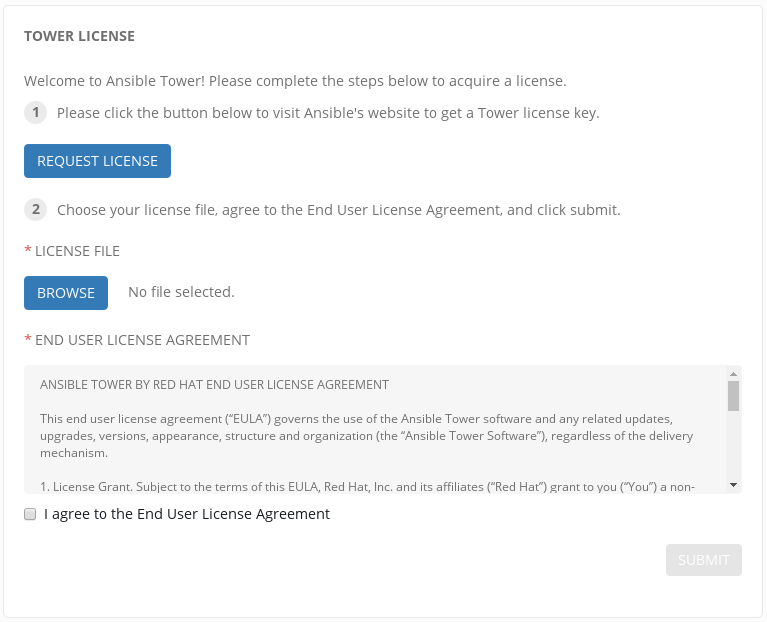
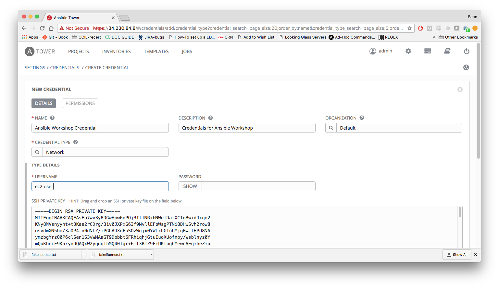
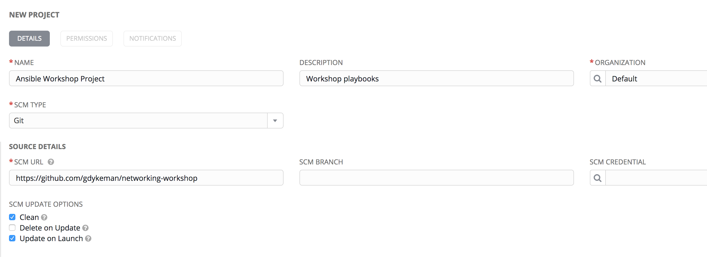
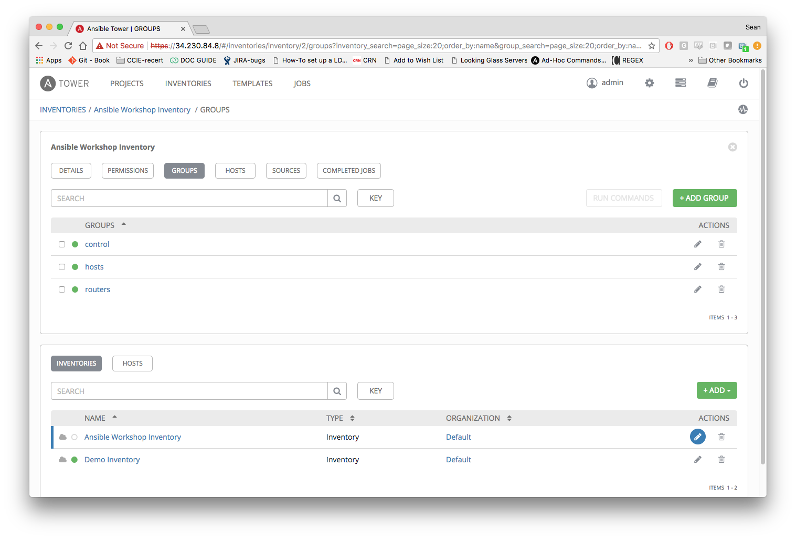

# Exercise 2.2 - Configuring Ansible Tower

In this exercise, we are going to configure Tower so that we can run a playbook.

# The Tower UI

There are a number of constructs in the Ansible Tower UI that enable multi-tenancy, notifications, scheduling, etc. However, we are only going to focus on a few of the key constructs that are required for this workshop today.

- Credentials
- Projects
- Inventory
- Job Template

## Logging into Tower and Installing the License Key

### Step 1: Login
Use the username `admin` and and the password `ansibleWS` (or whatever you made it in exercise 2.1)


As soon as you login, you will prompted to request a license or browse for an existing license file



## Step 2: Download the License
In a separate browser tab, download your license key by browsing to [fakelicense.txt](fakelicense.txt)

## Step 3: Browse for License
Back in the Tower UI, choose [BROWSE](browse.png) and upload your recently downloaded license file into Tower.

## Step 4: Check License
Select "I agree to the End User License Agreement"

## Step 5: Submit
Click on 

# Creating a Credential

Credentials are utilized by Tower for authentication when launching jobs against machines, synchronizing with inventory sources, and importing project content from a version control system.

There are many [types of credentials](http://docs.ansible.com/ansible-tower/latest/html/userguide/credentials.html#credential-types) including machine, network, and various cloud providers. In this workshop, we are using a network credential.

## Step 1: Select the gear icon
Click on the  icon in the top right of the browser window

## Step 2: Select CREDENTIALS

## Step 3: Click on  button

## Step 4: Complete the form using the following entries

- **NAME** Ansible Workshop Credential
- **DESCRIPTION** Credentials for Ansible Workshop
- **ORGANIZATION** Default
- **TYPE** Network
- **USERNAME** ec2-user
- **SSH Key** Copy paste in net-ws_key from control node @ ~/.ssh/net-ws_key



## Step 5: Select 

# Creating a Project
A Project is a logical collection of Ansible playbooks, represented in Tower. You can manage playbooks and playbook directories by either placing them manually under the Project Base Path on your Tower server, or by placing your playbooks into a source code management (SCM) system supported by Tower, including Git, Subversion, and Mercurial.

## Step 1: Click on PROJECTS

## Step 2: Select 

## Step 3: Complete the form using the following entries

- **NAME** Ansible Workshop Project
- **DESCRIPTION** Workshop playbooks
- **ORGANIZATION** Default
- **SCM TYPE** Git
- **SCM URL** https://github.com/gdykeman/networking-workshop
- **SCM UPDATE OPTIONS** Check Clean, Uncheck Delete on Update, Check Update on Launch



# Creating an Inventory

An inventory is a collection of hosts against which jobs may be launched. Inventories are divided into groups and these groups contain the actual hosts. Groups may be sourced manually, by entering host names into Tower, or from one of Ansible Tower’s supported cloud providers.

An Inventory can also be imported into Tower using the `tower-manage` command and this is how we are going to add an inventory for this workshop.

## Step 1: Click on INVENTORIES

## Step 2: Select 

## Step 3: Complete the form using the following entries

- **NAME** Ansible Workshop Inventory
- **DESCRIPTION** Ansible Inventory
- **ORGANIZATION** Default


## Step 4: Select 

## Step 5: Using ssh, login to your control node
```bash
ssh <username>@<IP_Address_of_your_control_node>
```

## Step 6: Use the tower-manage command to import an existing inventory. (Be sure to replace student(X) with your student number)

```bash
sudo tower-manage inventory_import --source=/home/ec2-user/networking-workshop/lab_inventory/student(x).net-ws.hosts --inventory-name="Ansible Workshop Inventory"
```

You should see output similar to the following:


Feel free to browse your inventory in Tower. You should now notice that the inventory has been populated with Groups and that each of those groups contain hosts.




End Result

At this point, we are doing with our basic configuration of Ansible Tower. In the next exercise, we will be solely focused on creating and running a job template so you can see Tower in action.
