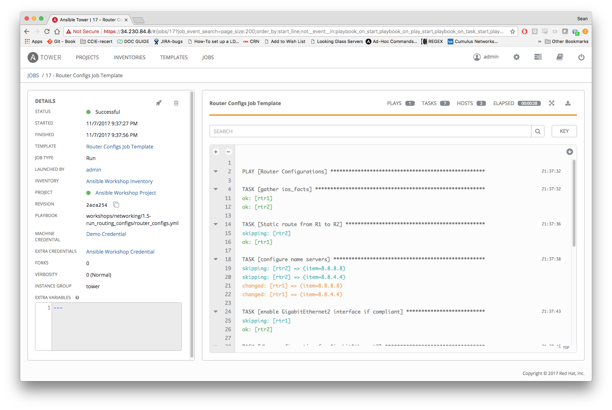

# Exercise 2.3 - Creating and Running a Job Template
A job template is a definition and set of parameters for running an Ansible job. Job templates are useful to execute the same job many times.

## Creating a Job Template

### Step 1: Select TEMPLATES

### Step 2: Click on  and select Job Template Add

### Step 3: Complete the form using the following values and SAVE

- **NAME** Router Configs Job Template
- **DESCRIPTION** Template for router configurations
- **JOB TYPE** Run
- **INVENTORY** Ansible Workshop Inventory
- **PROJECT** Ansible Workshop Project
- **PLAYBOOK** playbooks/router_configs.yml
- **MACHINE CREDENTIAL** Demo Credential - This is required by default and can contain blank credentials.
- **NETWORK CREDENTIAL** Ansible Workshop Credential

### Step 4: Select **ADD SURVEY**

### Step 5: Complete the survey form with following values. We are creating three survey questions.

Total: 3 Surveys

Survey 1:

- **PROMPT** Please enter the prefix to the host node
- **DESCRIPTION** Prefix for the host subnet
- **ANSWER VARIABLE NAME** prefix_host_subnet
- **ANSWER TYPE** Text
- **MINIMUM/MAXIMUM LENGTH** Use the defaults

- Then click +ADD Add

Second Survey:

- **PROMPT** Please enter the prefix to the control node
- **DESCRIPTION** Prefix for the control subnet
- **ANSWER VARIABLE NAME** prefix_control_subnet
- **ANSWER TYPE** Text
- **MINIMUM/MAXIMUM LENGTH** Use the defaults

- Then click +ADD Add

Third Survey:

- **PROMPT** Please enter the IOS Version
- **DESCRIPTION** Compliant IOS Version
- **ANSWER VARIABLE NAME** ios_version
- **ANSWER TYPE** Text
- **MINIMUM/MAXIMUM LENGTH** Use the defaults
- **DEFAULT ANSWER** 16.05.01b

### Step 6: Select **SAVE**

## Running a Job Template
Now that you’ve successfully created your Job Template, you are ready to launch it. Once you do, you will be redirected to a job screen which is refreshing in realtime showing you the status of the job.

### Step 1: Select JOB TEMPLATES

### Step 2: Click on the **rocketship icon** for the **Router Configs Job Template**

### Step 3: When prompted, enter your desired test message

### Step 4: Select **LAUNCH**

### Step 5: Sit back, watch the magic happen

Once the job is running, on the left, you’ll have details in regards to what playbook it’s running, what the status is, i.e. pending, running, or complete. You’ll also notice the prefix_control_subnet, prefix_host_subnet, and ios_version being passed in as 'extra_variables'

To the right, you can view standard output; the same way you could if you were running Ansible Core from the command line.

Congratulations!
You’ve successfully completed the Ansible Tower portion of the workshop!
