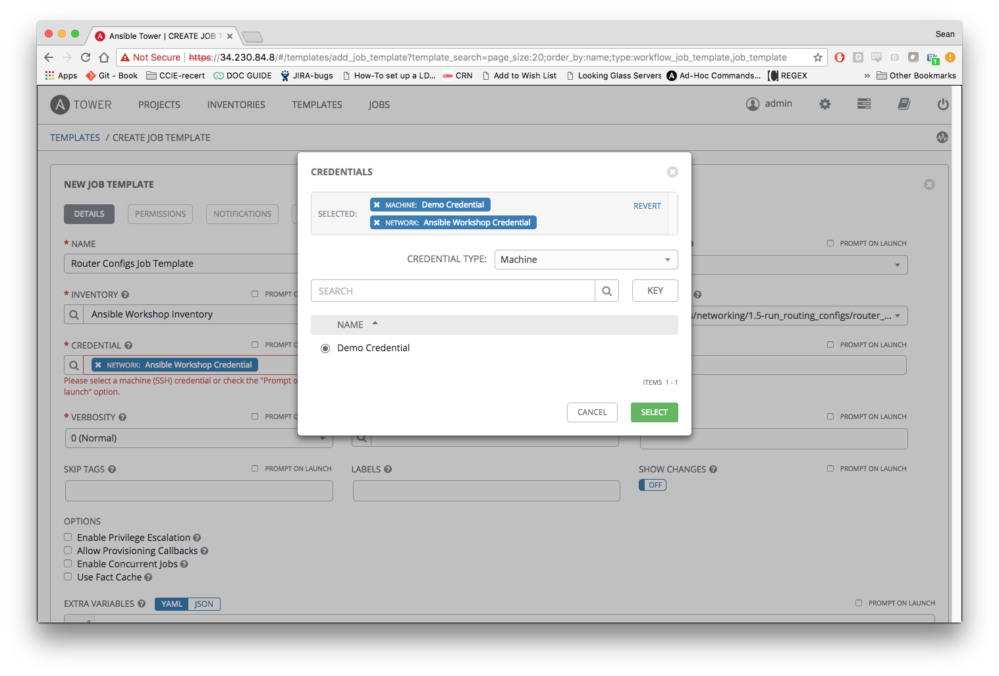
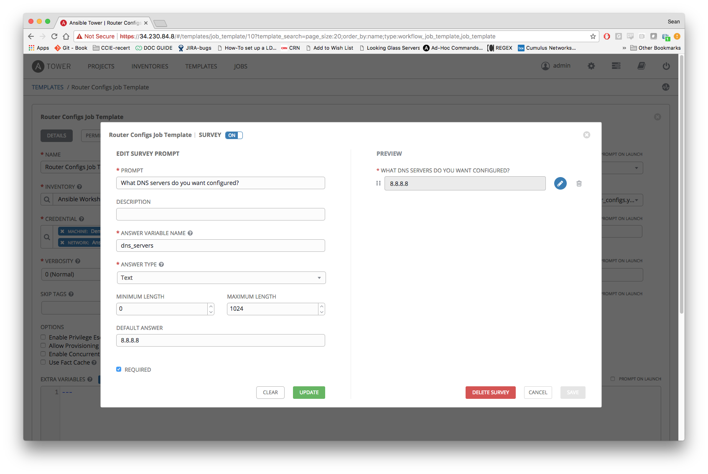
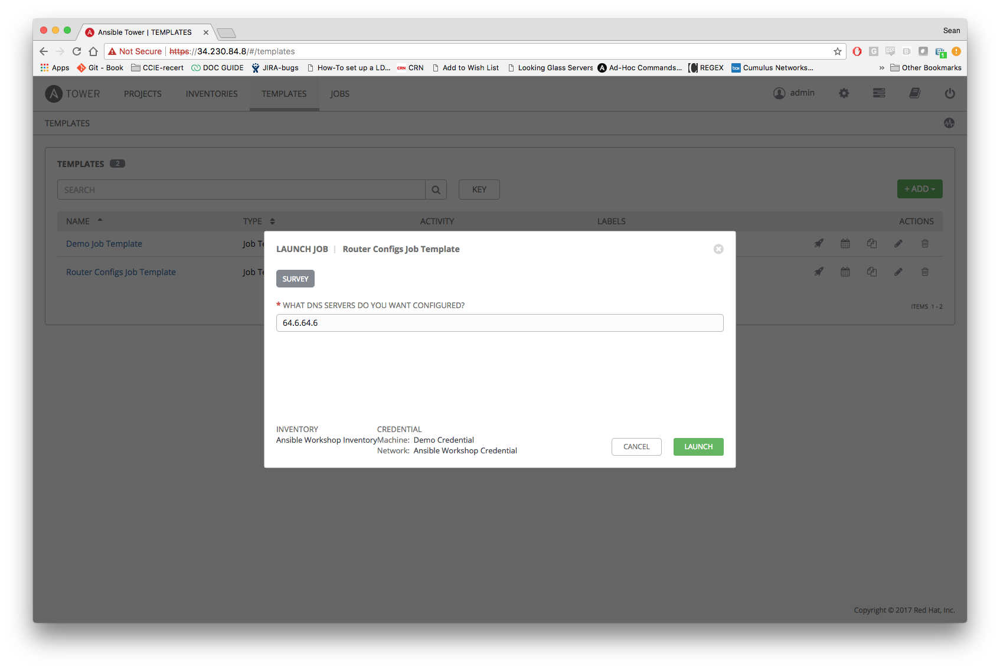

# Exercise 2.3 - Creating and Running a Job Template
A job template is a definition and set of parameters for running an Ansible job. Job templates are useful to execute the same job many times.

## Creating a Job Template

### Step 1: Select TEMPLATES
Click on the **TEMPLATES** Tab on the top menu

### Step 2: Add a Job
Click on the  button and select **Job Template** (not workflow template)

### Step 3: Complete the form using the following values and SAVE

| Field                  | Value                                                                                    |
| ---------------------- |------------------------------------------------------------------------------------------|
| **NAME**               | Router Configs Job Templat                                                               |
| **DESCRIPTION**        | Template for router configurations                                                       |
| **JOB TYPE**           | Run                                                                                      |
| **INVENTORY**          | Ansible Workshop Inventory                                                               |
| **PROJECT**            | Ansible Workshop Project                                                                 |
| **PLAYBOOK**           | workshops/networking/1.5-run_routing_configs/router_configs.yml                          |
| **MACHINE CREDENTIAL** | Demo Credential - This is required by default and can contain blank credentials.         |
| **NETWORK CREDENTIAL** | Ansible Workshop Credential                                                              |

See this screen shot to understand the machine and network credentials

### Step 4: Save the Job Template
Select the  button

## Running a Job Template
Now that you’ve successfully created your Job Template, you are ready to launch it. Once you do, you will be redirected to a job screen which is refreshing in realtime showing you the status of the job.

### Step 1: Go to the Jobs Section
Select the **JOBS** tab on the top menu

### Step 2: Run the Job
Click on the **rocketship icon** for the **Router Configs Job Template**

### Step 3: Sit back, watch the magic happen

Once the job is running, on the left, you’ll have details in regards to what playbook it’s running, what the status is, i.e. pending, running, or complete.

To the right, you can view standard output; the same way you could if you were running Ansible Core from the command line.

Congratulations!
You’ve successfully ran a job!

## Creating a Survey
Now we are going to show another awesome feature of Tower, called Surveys

### Step 1: Select TEMPLATES
Click on the **TEMPLATES** Tab on the top menu

### Step 2: Edit the Router Configs Job Template
Click the  icon to the right of the Router Configs Job Template

### Step 3: Create a Survey
Click **Add Survey** at the top

### Step 4: Fill out the Survey

| Field                           | Value                         |
| ------------------------------- |-------------------------------|
| **PROMPT**                      | Router Configs Job Template   |
| **ANSWER VARIABLE NAME**        | dns_servers                   |
| **ANSWER TYPE**                 | Text                          |
| **DEFAULT ANSWER**              | 8.8.8.8                       |

Also see the following screen shot:

### Step 5: Save the Survey
Select the  button

### Re-Run the Job
Click the **TEMPLATES** tab in the top menu and then click on the rocketship to re-launch the **Router Configs Job Template**

The survey will pop up when you launch, try changing the value to any real IPv4 DNS server!

The new job will run and use the IP address you chose in the survey.  The survey fills out the **EXTRA VARIABLES** on the left menu and over-rides any variables in the playbook.  This is illustrated in the following screenshot:

# Complete
You have now completed this Tower lab.

---
[Click Here to return to the Ansible Lightbulb - Networking Workshop](../README.md)
